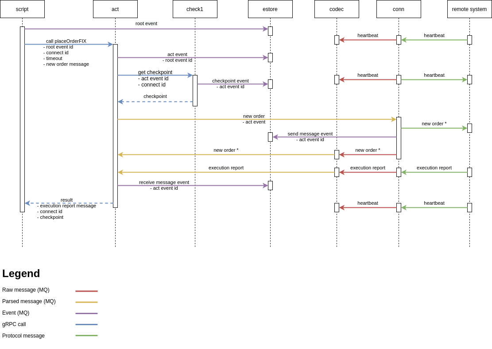
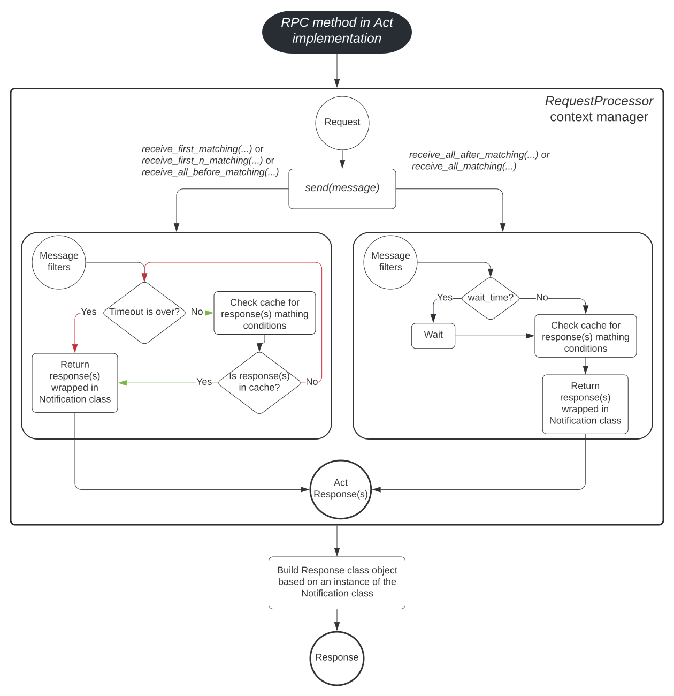

# TH2 Act Component (Python)

## Overview
This repository is a library for custom gRPC act projects (check [th2-act-template-py]() 
for the implementation template). The th2-act contains helper methods to create custom 
ActHadlers that implements custom gRPC API. Multiple ActHandlers allowed as well.


Act is a passive th2 component with parameterized functions which is implemented as 
part of the test logic. Script or other components can call these functions via gRPC. 
Act can interact with conn (Connects), hands, check1s, other acts to execute its tasks. 
Information about the progress of the task is published to the estore th2 component 
via MQ pin. This th2 component type allows frequently used script logic into it and 
then share it between all th2 components.

Most of them consists of the next steps:
1. Gets a gRPC request with parameters.
1. Requests checkpoint from check1 via gRPC pin
1. Sends the passed business message to Connect via mq pin 
1. Waits the specific business message from Connect during specified timeout 
1. Returns responded business message with checkpoint



## Installation
To install `th2-act` package run the following command in the terminal:
```
pip install th2-act
```

## Usage
Classes `Act` and `GRPCServer` may be [used in act implementation](https://gitlab.exactpro.com/vivarium/th2/th2-core-proprietary/th2-act-template-py/-/blob/th2-2871/th2_act_template/main.py) 
to upload act-handlers and run gRPC server.

`RequestProcessor` context manager may be [used in act implementation](https://gitlab.exactpro.com/vivarium/th2/th2-core-proprietary/th2-act-template-py/-/blob/th2-2871/th2_act_template/handlers/template_handler.py#L37)
to send requests to conn, save all received messages to the cache and 
retrieve messages from there using the filters described by the user.

`RequestProcessor` has several methods to work with its cache:
* method that returns first message that matches one of the filters:
    ```python
    receive_first_matching(message_filters: Dict[Callable, int],
                           timeout: Union[int, float] = None,
                           check_previous_messages: bool = True) -> ActResponse
    ```
* method that returns first N messages that match the filters:
    ```python
    receive_first_n_matching(message_filters: Dict[Callable, int],
                             n: int,
                             timeout: Union[int, float] = None,
                             check_previous_messages: bool = True) -> List[ActResponse]
    ```
* method that returns all messages preceding the first message (including it) that matches 
one of the filters:
    ```python
    receive_all_before_matching(message_filters: Dict[Callable, int],
                                timeout: Union[int, float] = None,
                                check_previous_messages: bool = True) -> List[ActResponse]
    ```
* method that returns all messages following the first message (including it) that matches 
one of the filters:
    ```python
    receive_all_after_matching(message_filters: Dict[Callable, int],
                               wait_time: Union[int, float] = None,
                               check_previous_messages: bool = True) -> List[ActResponse]
    ```
* method that returns all messages that match the filters:
    ```python
    receive_all_matching(message_filters: Dict[Callable, int],
                         wait_time: Union[int, float] = None,
                         check_previous_messages: bool = True) -> List[ActResponse]
    ```
  
Methods have the following arguments:

|Name                    |Status   |Type                               |Defaults               |Meaning |
|------------------------|---------|-----------------------------------|-----------------------|--------|
|message_filters         |required |Dict[lambda, RequestStatus.status] |-                      |The filter (lambda or function) through which the messages from cache will be filtered out - as key, RequestStatus (SUCCESS or ERROR) - as value.
|n                       |required |int                                |-                      |How much messages to return.
|timeout                 |optional |int of float                       |context time remaining |The time (in seconds) during which you are ready to wait for the messages. The messages will be returned as soon as the first matching message is found.
|wait_time               |optional |int of float                       |None                   |The time (in seconds) that the Act will wait before checking the cache for the matching message. Defaults to None (cache will be checked immediately and only once).
|check_previous_messages |optional |bool                               |True                   |Set True if you want to look for the response throughout all received responses; set False if you want to check only newly received responses.

All methods return either a `ActResponse` class instance or a list of `ActResponse` class instances.
`ActResponse` class contains the following fields:
* *message* - `Message`
* *status* - `RequestStatus`
* *checkpoint* - `CheckpointID`
* *text* - `str`

Schematically, the interaction with the `RequestProcessor` class can be represented as follows:



Implementation template is [here](https://gitlab.exactpro.com/vivarium/th2/th2-core-proprietary/th2-act-template-py/-/tree/th2-2871).
